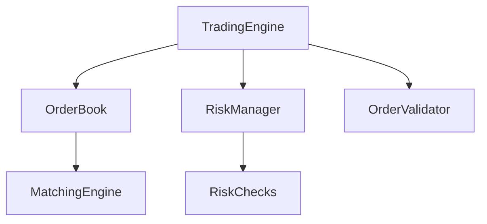

# Thoth Trading Engine


Thoth Trading Engine es un sistema de negociación bursátil de alto rendimiento desarrollado en Java 21. Nombrado en honor a Thoth, el dios egipcio de la sabiduría y los cálculos precisos, este motor de trading está diseñado para proporcionar operaciones de baja latencia y alta throughput.

## 🚀 Características

- Procesamiento de órdenes de baja latencia (<100 microsegundos)
- Matching engine altamente eficiente con prioridad precio-tiempo
- Soporte para múltiples tipos de órdenes:
    - Market Orders
    - Limit Orders
    - Stop Orders
    - Stop Limit Orders
    - IOC (Immediate or Cancel)
    - FOK (Fill or Kill)
    - Iceberg Orders
- Sistema de gestión de riesgos en tiempo real
- Diseño thread-safe y concurrente
- Logging asíncrono de alta performance

## 🛠 Requisitos del Sistema

- JDK 21 o superior
- Maven 3.8+
- 8GB RAM mínimo recomendado
- CPU multi-core
- Sistema operativo compatible con Java

## 📦 Instalación

1. Clonar el repositorio:
```bash
git clone https://github.com/yourusername/thoth-trading.git
cd thoth-trading
```

2. Compilar el proyecto:
```bash
mvn clean install
```

3. Ejecutar los tests:
```bash
mvn test
```

## 🔧 Configuración

### Maven Dependency

```xml
<dependency>
    <groupId>com.aaa</groupId>
    <artifactId>thoth-trading</artifactId>
    <version>1.0-SNAPSHOT</version>
</dependency>
```

### Parámetros JVM Recomendados

```bash
java -XX:+UseZGC \
     -XX:+UseNUMA \
     -XX:+AlwaysPreTouch \
     -XX:+DisableExplicitGC \
     -jar thoth-trading.jar
```

## 📚 Uso

### Inicialización del Motor

```java
TradingEngine engine = new TradingEngine();
engine.start();
```

### Procesamiento de Órdenes

```java
// Crear una orden límite
Order limitOrder = Order.limitOrder(
    "AAPL",         // symbol
    OrderSide.BUY,  // side
    150.0,          // price
    100L,           // quantity
    "TRADER1"       // traderId
);

// Procesar la orden
CompletableFuture<Order> result = engine.submitOrder(limitOrder);

// Obtener resultado
Order processedOrder = result.get();
```

### Consulta del Libro de Órdenes

```java
// Obtener snapshot del libro
OrderBook.BookSnapshot snapshot = engine.getOrderBookSnapshot("AAPL");

// Obtener estadísticas
OrderBook.BookStatistics stats = engine.getBookStatistics("AAPL");
```

## 📊 Arquitectura

### Componentes Principales



### Estructura del Proyecto

```
thoth-trading/
├── src/
│   ├── main/
│   │   ├── java/
│   │   │   └── com/
│   │   │       └── aaa/
│   │   │           └── thoth/
│   │   │               ├── core/
│   │   │               ├── engine/
│   │   │               └── util/
│   │   └── resources/
│   └── test/
│       └── java/
└── pom.xml
```

## 📈 Performance

- Latencia: <100 microsegundos (percentil 99)
- Throughput: >100,000 órdenes/segundo
- Uso de memoria optimizado
- Garbage Collection minimizado

## 🧪 Testing

Ejecutar todos los tests:
```bash
mvn test
```

Tests específicos:
```bash
mvn test -Dtest=OrderBookTest
mvn test -Dtest=TradingEngineTest
```

## 📝 Logging

El sistema utiliza SLF4J con Logback para logging. Configuración en `src/main/resources/logback.xml`:

```xml
<logger name="com.aaa.thoth.engine" level="INFO"/>
<logger name="com.aaa.thoth.core" level="INFO"/>
```

## 🔒 Seguridad

- Validación exhaustiva de órdenes
- Control de riesgos en tiempo real
- Límites por trader y símbolo
- Protección contra manipulación de mercado

## 🤝 Contribución

1. Fork el repositorio
2. Crear una rama (`git checkout -b feature/amazing`)
3. Commit los cambios (`git commit -m 'Add amazing feature'`)
4. Push a la rama (`git push origin feature/amazing`)
5. Abrir un Pull Request

## 📄 Licencia

Este proyecto está licenciado bajo la Licencia MIT - ver el archivo [LICENSE](LICENSE) para más detalles.

## 👥 Equipo

- Development Team - [dev@company.com](mailto:alejandro.antivero@gmail.com)
- Support Team - [support@company.com](mailto:alejandro.antivero@gmail.com)

## 🔗 Links Útiles

- [Issues](https://github.com/aantivero/thoth-trading/issues)

